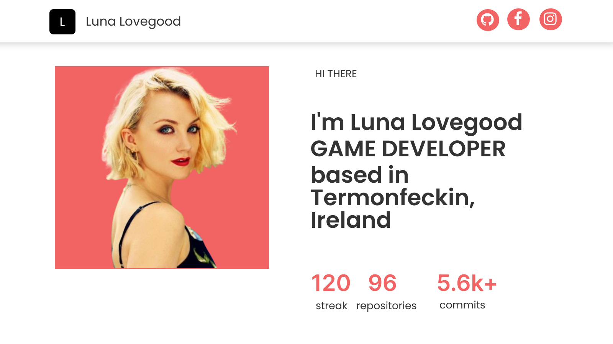
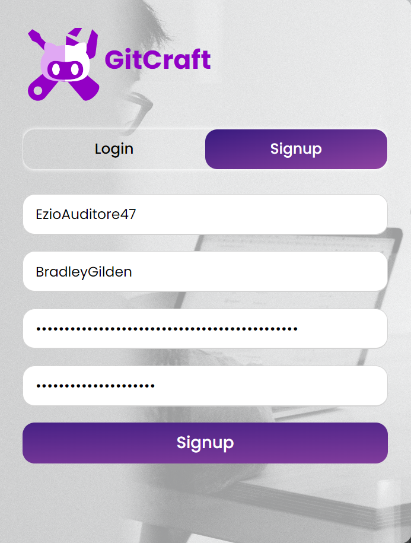
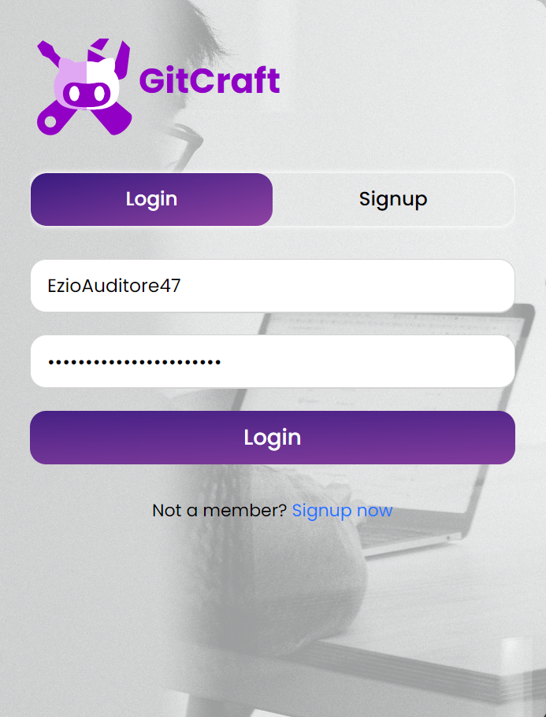
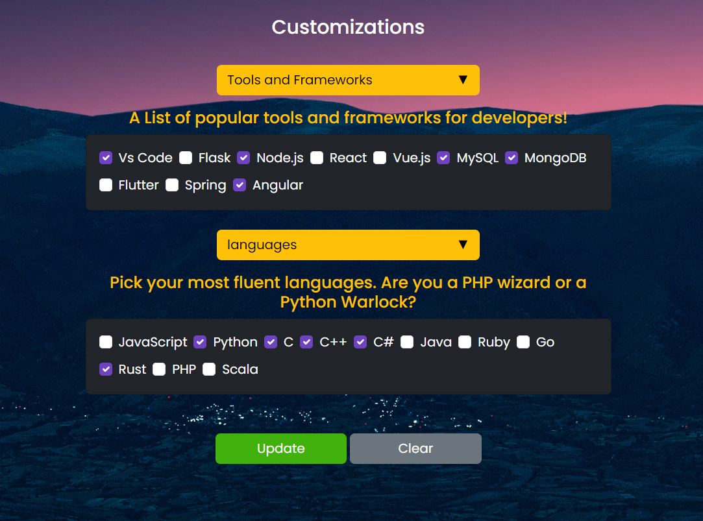
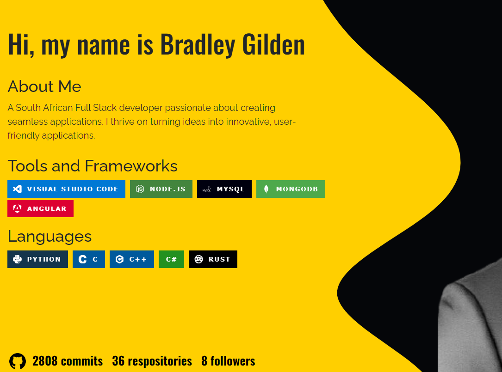

<!-- <table border="5">
    <tr>
        <td width="200"></td>
        <td width="600"><h1 align='center'>GitCraft</h1></td>
    </tr>
</table> -->

<h2 align="center">
<p>Crafting Careers One Commit at a Time </p>
</h1>
<br>
<p align="center">
    <a href="#">
    
    </a>
    <a href="https://gitcraft1-alx.koyeb.app/">
    
    </a>
    <a href="https://gitcraft.bradleygilden.tech">
    
    </a>
</p>

* [About](#about)
* [Demo](#demo)
  * [signup/login](#signuplogin)
  * [settings](#settings)
* [Create Your Own Instance](#create-your-own-instance)
  * [Installation](#installation)
  * [Testing](#testing)
  * [Deploy on serverless host - Koyeb](#deploy-on-serverless-host---koyeb)
  * [Deploy on cloud server](#deploy-on-cloud-server)
* [Important Path Descriptions](#important-path-descriptions)
* [Blog](#blog)
* [Credits](#credits)


<div align="center">

## About

</div>

The main goal of *GitCraft* is to offer GitHub users a **free** alternative to showcase their skills by generating templates populated by a user's GitHub data and stats. The user will have the opportunity to download the template and host it on their own platform. As of now, these templates consist of 3 portfolio websites. More template customization options and types are in the works.

### *sample of generated template*

<p>
    

<div align="center">

## Demo

</div>

This demo will cover some key points in the websites usage

### Signup/Login

When you get passed the landing page you will be taken to a signup and login page

<table>
    <tr>
        <th><div align="center">Signup</div></th>
        <th><div align="center">Login</div></th>
    </tr>
    <tr>
        <td>
            
        </td>
        <td>
            
        </td>
    </tr>
    <tr>
        <td colspan="2" align="center">Input Fields</td>
    </tr>
    <tr>
        <td>Enter a Custom Username</td>
        <td>Enter a Custom Username</td>
    </tr>
    <tr>
        <td>Enter Github Login Name</td>
        <td>Enter a Custom Password</td>
    </tr>
    <tr>
        <td>Enter GitHub Token (with admin permissions)</td>
        <td></td>
    </tr>
    <tr>
        <td>Enter a Custom Password</td>
        <td></td>
    </tr>
</table>

If your GitHub Login Name and Token are valid, you will then be taken to the dasboard

### Settings

The settings page is essential in controlling the content of data generated on your templates. There are sections:

* GitHub Details - These settings update details on your github account and in turn alter the content on your templates. These details include:
  * Display Name
  * Email address
  * Bio
  * Location
  * Hireable status
  * Company name

* Customization Settings. These allow you to select languages and frameworks that you specialize in to add to your template. This info is stored with the rest of your account information
  <table>
      <tr>
        <td></td>
        <td></td>
    </tr>
  </table>

Once you are satisfied with your settings, you can head over to the *Templates* page to either view or download a generated template.

</p>

<div align="center">

## Create Your Own Instance

</div>

This Project is open to any modifications by other developers. If you are to deploy your own instance of the project these are the steps you must follow.

### Installation

> N.B project requires python 3.8 -> 3.*
* Fork and Clone the GitCraft Repository
* Replace mongoDB connector string in [app/config.py](./app/config.py) to your own mongoDB instance. See [mongoDB Atlas](https://www.mongodb.com/atlas/database) for cloud storage or [how to install mongodb](https://www.mongodb.com/docs/manual/administration/install-community/) for  local storage
* In the project root execute:
  ```sh
  pip install -r requirements.txt
  ```
  a python virtual environment is recommended, see [venv](https://www.freecodecamp.org/news/how-to-setup-virtual-environments-in-python/)

### Testing

* To test your instance, in your terminal run:
  ```
  python3 -m app.app
  ```
* To view it in you browser go to: [https://localhost:5500](https://localhost:5500)

### Deploy on serverless host - Koyeb

[Koyeb](https://koyeb.com) is a servereless hosting platform that enables you to host projects of a variety of frameoworks free of charge with a limit of server regions and memory up to 2gb disk | 256mb RAM. Which is sufficient for small scale projects such as these. If you want to upscale your project you have to pay extra fees.

Tutorial for [Hosting flask project on Koyeb using Docker container](https://www.koyeb.com/tutorials/python-flask-application-deployment-on-koyeb)

### Deploy on cloud server

This method requires prior knowledge of configuring and maintaining web servers such as Nginx or Apache, this is not recommended unless you are experienced.

See [Google Cloud Platform](https://cloud.google.com) or [Digital Ocean](https://www.digitalocean.com). These platforms offer free credits upon signing up to keep your server running for a few months.

<div align="center">

## Important Path Descriptions

<table>
    <tr>
        <th><div align="center">Path</div></th>
        <th><div align="center">Descriptions</div></th>
    </tr>
    <tr>
        <td>app/</td>
        <td>The project source code is stored here</td>
    </tr>
    <tr>
        <td>app/app.py</td>
        <td>Flasks entry point for the application</td>
    </tr>
    <tr>
        <td>app/config.py</td>
        <td>Contains important constants used throughout the application</td>
    </tr>
    <tr>
        <td>app/blueprints/</td>
        <td>contains extensions of flasks api dealing with calls to github, mongodb and returning generated templates</td>
    </tr>
    <tr>
        <td>app/modules/</td>
        <td>contains helper methods and classes for the logic inside app/blueprints/</td>
    </tr>
    <tr>
        <td>app/static/</td>
        <td>contains resources, javascript and css styles of the website and generated templates</td>
    </tr>
    <tr>
        <td>app/templates/</td>
        <td>contains all html used on the website and for all the generated templates</td>
    </tr>
</table>

</div>

<div align="center">

## Credits

</div>

* [Custom Alerts - SweetAlert2](https://sweetalert2.github.io/)
* [Charts - Chart.js](https://chartjs.org)
* [Badges - Shields.io](https://shields.io)
* [Icons - Icons8.com](https://icons8.com)
* [Image resources - Unsplash.com](https://unsplash.com)

<div align="center">

## Blog

</div>
<p align="center">
    
    
</p>
<p align="center">
<a href="https://www.buymeacoffee.com/comascript" target="_blank"></a>
</p>
